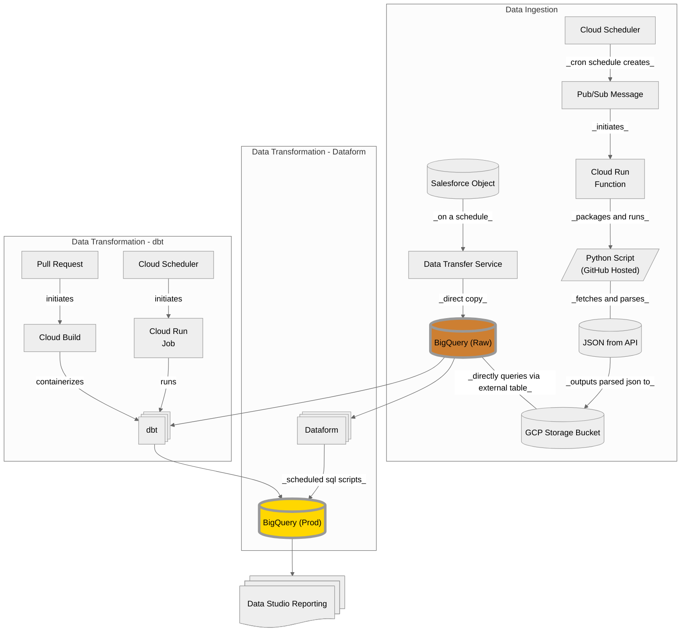

# Purple Otter Data Integration Demos
_Note: Below are solutions we've explored so far. Unexplored alternatives, for better or worse, may exist._
# GCP
## Data Integration
| Source System             | Method
| :-                        | :-
| Salesforce                | Salesforce Data Federation or BigQuery Data Transfer Service.
| Hubspot                   | BigQuery Data Transfer Service or Hubspot Data Hub Sync.
| Generic JSON/CSV          | Python + Cloud Run.
| SFTP                      | Python + Cloud Run.

| Method                                    | Pros                                                                                | Cons                                                                        | Notes
| :-                                        | :-                                                                                  | :-                                                                          | :-
| Salesforce Data Federation                | Native integration. Data stored in one place. Real-time data. No schema drift.      |                                                                             | Data is directly queried through BigQuery.
| BigQuery Data Transfer Service            | Native integration. Scheduled updates as frequently as needed.                      | Data stored in multiple places. Schema drift management.                    | Data is copied directly to BigQuery tables. Data Transfer for Hubspot is in preview (beta).
| Hubspot Data Hub Sync                     | Native integration. No schema drift.                                                | Beta integration. Only daily updates. Data stored in multiple places.       | Data is copied as parquet files to GCP storage.
| Python + Cloud Run                        | Scheduled updates as frequently as needed.                                          | Custom integration. CI/CD management.                                       | Can run any containerized application (JS, Ruby, Java, etc).

## Demo Use Case
- _Ping Chris for access._
- Ingest data from salesforce account object and raw JSON file.
- Transform data into BI ready production tables.
- Provide a solution using low-cost IaaS resources.
###  Prerequisites
- Cloud Storage Bucket
- Cloud Scheduler
- Cloud Run
- BigQuery
- Datatransfer
- Dataform
- Python
- GitHub Repo
### Solution Overview


# Azure
## Data Integration
| Source System             | Method
| :-                        | :-
| Salesforce                | Salesforce Data Federation or Azure Data Factory - Copy Data Activity.
| Hubspot                   | Azure Data Factory - Copy Data Activity.
| Generic JSON/CSV          | Azure Data Factory - Copy Data Activity.
| SFTP                      | Azure Data Factory - Copy Data Activity.


| Method                                    | Pros                                                                                      | Cons                                                                        | Notes
| :-                                        | :-                                                                                        | :-                                                                          | :-
| Salesforce Data Federation                | Native integration. Data stored in one place. Real-time data. No schema drift.            | Requires dedicated SQL pool (expensive).                                    | Likely better off using Microsoft Fabric.
| Azure Data Factory - Copy Data Activity   | Native integration. Scheduled updates as frequently as needed. No schema drift.           | Data stored in multiple places.                                             | Data is copied as parquet/json/csv files to Azure storage blob. Hubspot integration does not support custom objects.

## Demo Use Case
- _Ping Chris for access._
- Ingest data from salesforce account object and raw JSON file.
- Transform data into BI ready production tables.
- Provide a solution using low-cost IaaS resources.
## Prerequisites
- Azure Data Factory
- Azure Synapse Analytics
- Serverless SQL Pool
- Azure Storage Blob
### Solution Overview

### Notes
- You can use a the Dataflow service to achieve a lot of the same results but it runs on spark notebooks which can be pretty expensive.
- If we were using very large datasets that may be justified but for the small scale of our data it was more cost effective to use pipeline activities + SQL scripts.

# Marketing Attribution
## Tactical Attribution Modeling
- Single-Touch (STA)
    - Last-Touch, First-Touch.
- Multi-Touch (MTA)
    - Rules based.
    - Linear, Time Decay, Position Based.
- Data-Driven & Algorithmic (DDA)
    - Black box process.
- Incremental Testing
    - Brand/Conversion Lift Testing.
## Marketing Mix Modeling (MMM)
- Strategic modeling used to complement tactical modeling above.
- Determine how much each marketing channel contributes to an outcome.
- Identify channels to scale.
- Typically regression modeling sometimes bayesian modeling.
### MMM w/ BigQuery
- Linear Regression Model
    ```
    CREATE OR REPLACE MODEL `mktg.mmm`
    OPTIONS (
        model_type = 'linear_reg',
        input_label_cols = ['log_donations']
    ) AS
    {{ SELECT columns }}
    {{ FROM dataset }}
    ```
- Model Evaluation:
    - Mean Abolute Error:
        - Average difference between predicted and actual values.
        - Lower is better.
    - R squared:
        - Proportion of variance explained by model.
        - 0 to 1.
        - Higher is better.
        - Aim for > 0.25  and < 0.80 as > 0.80 can be a sign of overfitting in a marketing context.
    - Use below query to see how each input variable contributes to the output variable.
    ```sql
    SELECT * FROM ML.WEIGHTS(MODEL mktg.mmm)
    ```
    - Example
        | Variable            | Value                
        | :-                  | :- 
        | log_spend_channel_a | 0.0938 
        | log_spend_channel_b | 0.0993  
        | log_spend_channel_c | 0.0930  
        | log_spend_channel_d | 0.1319
    - Channel D is strongest performer.
    - Each 1% increase in spend for this channel can increase outcomes by 0.13%.

# K-Means Modeling
- Partition data into clusters where points in one cluster are different from another.
- Requires continuous numerical data. Non-continuous data can be converted.
- BigQuery automatically handles conversion of categorical columns into numerical representations.
- BigQuery ML automatically standardizes numerical data for K-means models.
- Requires a data structure where one row represents and observation and each column represents a characteristic of that observation.
