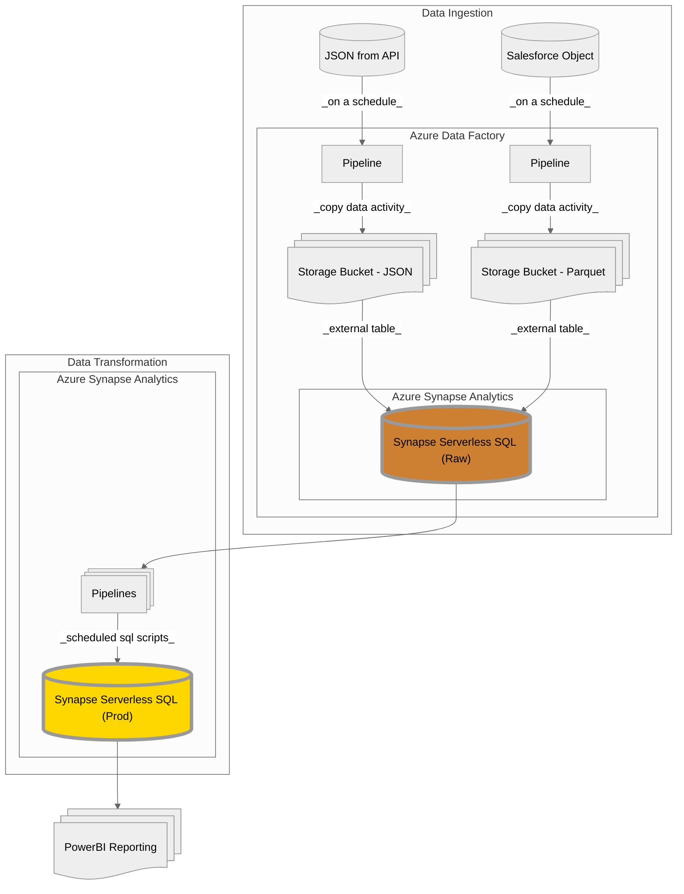

# po-demos
# GCP Process

```mermaid
---
config:
  theme: 'neutral'
---
flowchart TB
    bq_raw@{ shape: cyl, label: "BigQuery (Raw)"}
        style bq_raw fill: #CD7F32, stroke-width:5px
    bq_prod@{ shape: cyl, label: "BigQuery (Prod)"}
        style bq_prod fill: #FFD700, stroke-width:5px
    sf@{ shape: cyl, label: "Salesforce Object" }
    gcp_store@{ shape: cyl, label: "GCP Storage Bucket" }
    trx@{ shape: cyl, label: "JSON from API"}
    data_transfer@{ shape: process, label: "Data Transfer Service"}
    dataform@{ shape: processes, label: "Dataform"}
    cloud_scheduler@{ shape: process, label: "Cloud Scheduler"}
    pubsub@{ shape: process, label: "Pub/Sub Message"}
    cloud_run@{ shape: process, label: "Cloud Run"}
    python@{ shape: lean-r, label: "Python Script \n (GitHub Hosted)"}
    bi@{ shape: docs, label: "Data Studio Reporting" }
    spacer[ ]
        style spacer opacity:0,height:5px

    subgraph ingestion["Data Ingestion"]
        direction TB
        data_transfer
        cloud_scheduler --> |_cron schedule creates_| pubsub
        pubsub --> |_initiates_| cloud_run
        cloud_run --> |_packages and runs_| python
        python --- |_fetches and parses_| trx --> |_outputs parsed json to_| gcp_store
        sf --> |_on a schedule_| data_transfer
        data_transfer --> |_direct copy_| bq_raw
        bq_raw --- |_directly queries via external table_| gcp_store
    end

    subgraph transformation["Data Transformation"]
        spacer ~~~ dataform
        dataform --> |_scheduled sql scripts_| bq_prod
    end

    bq_raw --> dataform
    bq_prod --> bi
```

# Azure Process

```mermaid
---
config:
  theme: 'neutral'
---
flowchart TB
    synapse_raw@{ shape: cyl, label: "Synapse Serverless SQL (Raw)"}
        style synapse_raw fill: #CD7F32, stroke-width:5px
    synapse_prod@{ shape: cyl, label: "Synapse Serverless SQL (Prod)"}
        style synapse_prod fill: #FFD700, stroke-width:5px
    sf@{ shape: cyl, label: "Salesforce Object" }
    trx@{ shape: cyl, label: "JSON from API"}
    storage_json@{ shape: docs, label: "Storage Bucket - JSON" }
    storage_parquet@{ shape: docs, label: "Storage Bucket - Parquet" }
    adf_pipeline1@{ shape: process, label: "Pipeline"}
    adf_pipeline2@{ shape: process, label: "Pipeline"}
    as_pipeline1@{ shape: processes, label: "Pipelines"}
    bi@{ shape: docs, label: "PowerBI Reporting" }
    spacer[ ]
        style spacer opacity:0,height:5px

    subgraph ingestion["Data Ingestion"]
        direction TB
        sf --> |_on a schedule_| adf_pipeline2
        trx --> |_on a schedule_| adf_pipeline1
        subgraph adf["Azure Data Factory"]
            adf_pipeline1 --> |_copy data activity_| storage_json
            adf_pipeline2 --> |_copy data activity_| storage_parquet
            storage_json --> |_external table_| synapse_raw
            storage_parquet --> |_external table_| synapse_raw
            subgraph asa["Azure Synapse Analytics"]
                synapse_raw
            end
        end
    end

    subgraph transformation["Data Transformation"]
        direction TB
        subgraph asa2["Azure Synapse Analytics"]
            spacer ~~~ as_pipeline1
            as_pipeline1 --> |_scheduled sql scripts_| synapse_prod
        end
    end

    synapse_raw --> as_pipeline1
    synapse_prod --> bi
```